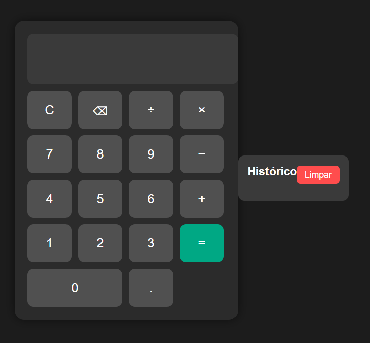

# Calculadora-JavaScript-Projeto-de-Estudo.

## 🚀 Funcionalidades

- ✅ Operações básicas: soma, subtração, multiplicação e divisão.
- ✅ Histórico de cálculos salvo automaticamente no navegador.
- ✅ Botão para limpar o histórico completo.
- ✅ Suporte ao teclado físico (Enter, Backspace, Esc, números e operadores).
- ✅ Interface moderna com tema escuro.

## 🧠 Tecnologias utilizadas

- **HTML5** — estrutura da aplicação  
- **CSS3** — estilização e layout responsivo  
- **JavaScript (Vanilla JS)** — lógica da calculadora e controle de eventos  
- **LocalStorage** — armazenamento do histórico no navegador  

## 🧩 Aprendizados

Durante o desenvolvimento deste projeto, pratiquei:
- Manipulação do **DOM** com JavaScript.  
- Criação de **funções interativas** e reutilizáveis.  
- Uso de **eventos de teclado** para melhorar a usabilidade.  
- Armazenamento e exibição de dados com **LocalStorage**.  
- Organização do código com **comentários claros** e boas práticas.

- 
